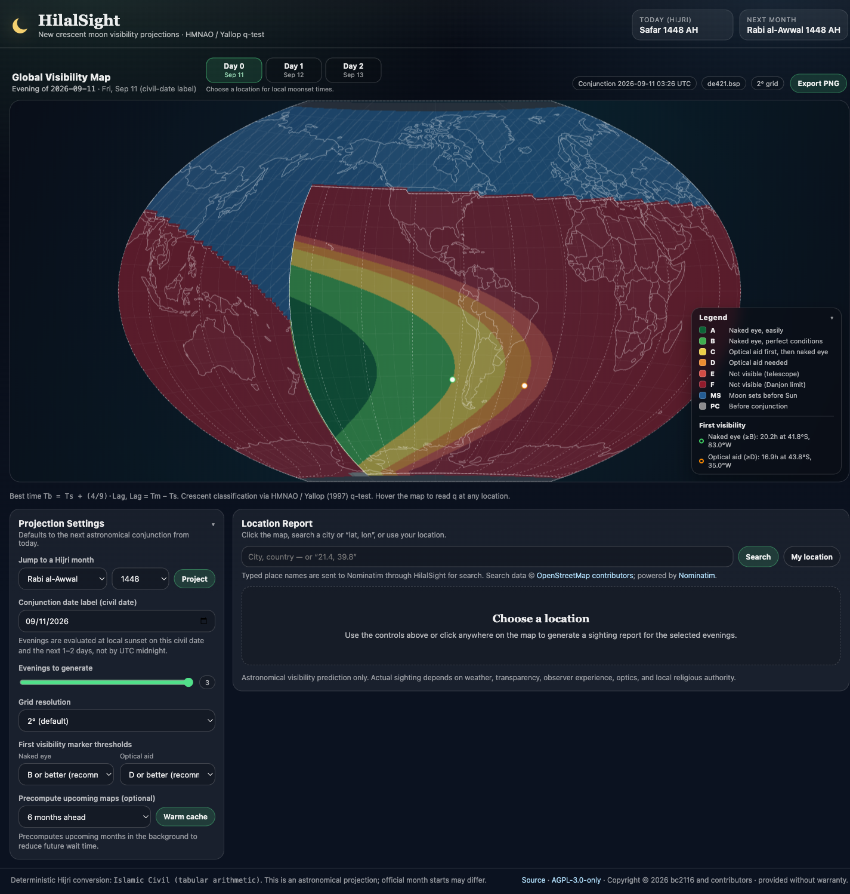
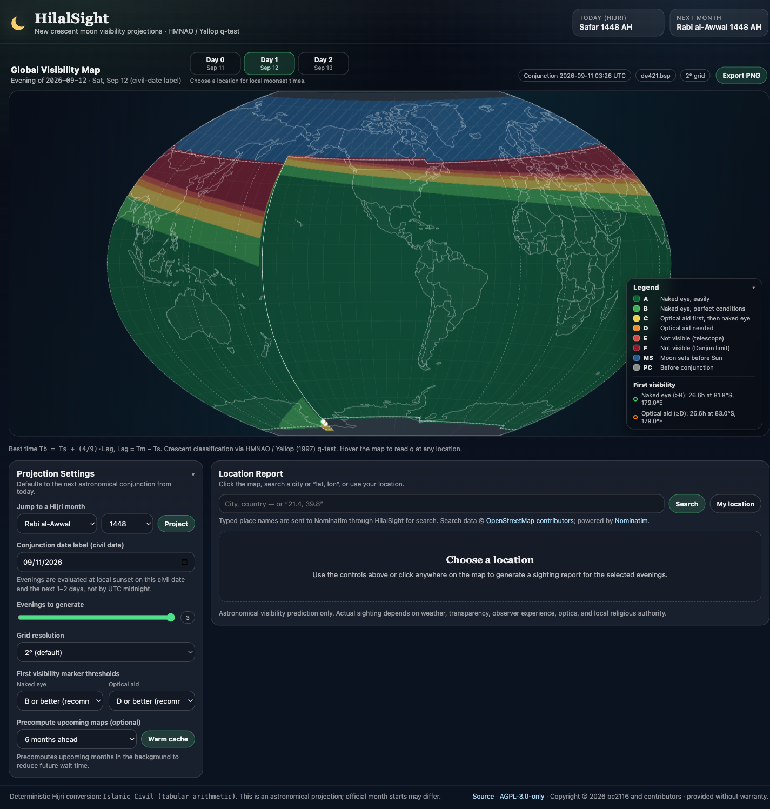

# HilalSight

HilalSight estimates where the new crescent moon (*hilal*) may be visible using the HMNAO/Yallop (1997) q-test and renders global visibility maps with overlays for:

- Moon sets before the Sun
- Moon prior to conjunction (new moon)
- No sunset or no moonset during the requested civil day

> [!IMPORTANT]
> HilalSight is an astronomical planning and educational tool. It does not make an official religious determination. Actual sighting depends on weather, atmospheric transparency, observer experience, optics, and the rules of the relevant local authority.

## Architecture

The repository deliberately contains two calculation runtimes behind the same `/api` contract:

| Capability | Local Docker/development app | Hosted Sites app |
| --- | --- | --- |
| UI | React + TypeScript + Vite | The same React interface |
| API | FastAPI + Python | Cloudflare Worker-compatible route handlers |
| Astronomy engine | Skyfield with JPL DE421 | Astronomy Engine |
| Map grids | 0.5°, 1°, 2°, and 5° | 2° and 5° |
| Cache | Disk-backed grids and optional cache warming | Bounded, on-demand in-memory/edge caching |
| Place-name search | Server-proxied Nominatim with strict local throttling | Disabled; use map clicks or coordinates |
| Intended use | Local scientific reference and higher-detail work | Public, lower-cost interactive access |

Both runtimes implement the same Yallop equations, civil-date semantics, validation limits, and response shapes. They use different ephemeris engines, so floating-point values are not expected to be bit-for-bit identical. Near a q-category threshold, compare the q value and underlying event times rather than treating a one-letter difference as scientifically meaningful. As an operational caution, values within about `0.001` of a threshold should be treated as boundary-sensitive; that tolerance is a HilalSight review convention, not part of the Yallop method.

Accepted base date labels are **1900-01-01 through 2050-12-31**, inclusive. Requested day offsets and event times near an endpoint can fall outside those label bounds, and the “next conjunction” can be up to one lunation later; these are reported as event data rather than accepted as new base-date requests.

## Quick Start With Docker

```bash
docker compose up --build
```

- App: `http://localhost:5173`
- API status: `http://localhost:8000/api/status`

Docker Compose binds both ports to `127.0.0.1`; the local API is not intended to be exposed directly to the public internet. It has computationally expensive map and cache-warming routes but no user authentication or public-service rate limiter.

On first use, the backend downloads Skyfield time-scale data and JPL `de421.bsp` into the `hilalsight_skyfield` volume. HilalSight verifies the DE421 file before use against this SHA-256 digest:

```text
a20a7139da04cbc462454634918e9a9ca69127044e2cc9d4f9c16e238d2deedc
```

The backend entrypoint repairs ownership on existing named volumes when needed, then drops to the unprivileged UID/GID `10001` before starting the API. This lets upgrades reuse volumes that older root-running images created without leaving the application process privileged.

Very early development builds used DiskCache. Their obsolete `cache.db` and hashed `.val` entries may remain in an upgraded `hilalsight_cache` volume, but current releases neither read nor grow them. They are retained to avoid an automatic destructive migration; the cache volume can be recreated later if an operator wants to reclaim that recoverable space.

If verification fails, the backend stops instead of calculating with an unexpected kernel. See the [Skyfield planetary documentation](https://rhodesmill.org/skyfield/planets.html) for background on JPL ephemerides.

## Local Development

Use Python 3.13 and Node.js 22.13 or newer.

### Backend

```bash
cd backend
python3 -m venv .venv
./.venv/bin/pip install -r requirements-dev.txt
./.venv/bin/uvicorn app.main:app --reload --port 8000
```

### Frontend

```bash
cd frontend
npm ci
npm run dev
```

Open `http://localhost:5173`.

### Hosted adapter

```bash
cd sites
npm ci
npm run dev -- --hostname 127.0.0.1
```

The hosted adapter intentionally disables cache warming and limits public maps to 2° and 5° grids. Publishing this repository does not deploy the Sites adapter; deployment is a separate release step whose live source/license footer and API behavior must be verified afterward.

## Validation

Run the full release checks from the repository root:

```bash
cd backend
./.venv/bin/pytest
./.venv/bin/pip-audit -r requirements-dev.txt
./.venv/bin/bandit --quiet --recursive app docker-entrypoint.py

cd ../frontend
npm ci
npm run lint
npm run build
npm audit --audit-level=high

cd ../sites
npm ci
npm run lint
npm test
npm audit --audit-level=high
```

Current automated coverage includes q-polynomial and category boundaries, best-time arithmetic, global-map sanity, map/point agreement for a high-latitude grazing moonset, supported-date and input validation, polar-day behavior, trusted-origin protection for local cache warming, ephemeris metadata/checksum handling, hosted server rendering, API contract checks, offset-aware local times, and complete hosted map-grid output. The backend also has dependency and static-security gates. Frontend correctness is currently checked by TypeScript build and ESLint rather than a dedicated unit-test suite.

## What The App Does By Default

When opened, HilalSight:

1. Shows today's Hijri month/year and the next month using deterministic **Islamic Civil (tabular)** conversion. Official starts may differ.
2. Finds the next astronomical new moon (conjunction).
3. Offers three evenings—Day 0, Day 1, and Day 2—starting with the UTC date label of conjunction, and computes the selected map on demand.
4. Evaluates each day offset at local sunset on that civil date.

## Visibility Model

For each location and selected evening:

1. Compute local sunset `Ts` at the geometric, sea-level horizon.
2. Compute moonset `Tm` after `Ts`.
3. If `Tm <= Ts`, classify the point as **Moon sets before the Sun**.
4. Compute `Lag = Tm - Ts` and best time `Tb = Ts + (4/9) * Lag`.
5. If `Tb` precedes conjunction, classify the point as **Moon prior to conjunction**.
6. At `Tb`, compute:
   - `ARCL`: geocentric Sun-Moon angular separation in degrees
   - `ARCV`: Moon altitude minus Sun altitude in degrees, without refraction in the definition
   - `DAZ`: Sun azimuth minus Moon azimuth in degrees
   - `W'`: topocentric crescent width in arcminutes
7. Compute:

```text
q = (ARCV - (11.8371 - 6.3226*W' + 0.7319*W'^2 - 0.1018*W'^3)) / 10
```

8. Classify by q:

| Category | q range | Interpretation |
| --- | --- | --- |
| A | `q > +0.216` | Easily visible to the naked eye |
| B | `+0.216 >= q > -0.014` | Visible to the naked eye under perfect conditions |
| C | `-0.014 >= q > -0.160` | May need optical aid initially, then naked eye |
| D | `-0.160 >= q > -0.232` | Will need optical aid |
| E | `-0.232 >= q > -0.293` | Not visible with a conventional telescope |
| F | `q <= -0.293` | Not visible—below the Danjon limit |

Model reference: B. D. Yallop, “A Method for Predicting the First Sighting of the New Crescent Moon,” HM Nautical Almanac Office, NAO Technical Note No. 69 (June 1997; updated April 1998). HilalSight independently implements the published equations and does not include the original note.

## Privacy And Third-Party Services

- In the loopback local app, typed place searches go to HilalSight's same-origin API, which forwards the search text to the public [Nominatim](https://nominatim.org/) geocoder. The UI displays [OpenStreetMap attribution](https://www.openstreetmap.org/copyright), and the server validates, serializes, times out, bounds, and caches requests. Do not enter a home address, personal identifier, or other sensitive text: it is sent to a third-party service.
- Hosted place-name search is disabled because an in-memory Worker cannot guarantee Nominatim's aggregate application-wide usage limit across isolates. Hosted users can click the map, enter `latitude, longitude`, or use browser location. A future public deployment may substitute a centrally throttled or appropriately provisioned geocoder.
- “Use my location” requires browser permission. Coordinates are sent to HilalSight's same-origin point-visibility endpoint; they are not used for a Nominatim place search.
- The repository contains no login or account system. Hosting and upstream providers may still produce their normal service logs; consult the policy of the deployment you use.

## API

The local and hosted runtimes share these read endpoints:

- `GET /api/status`
- `GET /api/hijri/today`
- `GET /api/hijri/from-gregorian?date=YYYY-MM-DD`
- `GET /api/hijri/to-gregorian?year=1448&month=2&day=1`
- `GET /api/newmoon/next?from=YYYY-MM-DD`
- `GET /api/visibility/map?date=YYYY-MM-DD&dayOffset=0&resolution=2`
- `GET /api/visibility/point?lat=21.4225&lon=39.8262&date=YYYY-MM-DD&dayOffset=0`
- `GET /api/cache/warm/status`

The local runtime also supports:

- `GET /api/geocode/search?q=Makkah`
- `POST /api/cache/warm?monthsAhead=6&evenings=3&resolution=2`

Cache warming is limited to 3, 6, or 12 months; 1–3 evenings; and 2° or 5° grids. It runs in the background and can use substantial CPU. The hosted runtime returns `409` for cache warming and `501` for place-name geocoding.

## Screenshots





## Contributing And Security

See [CONTRIBUTING.md](CONTRIBUTING.md) for the change and validation workflow. Report suspected vulnerabilities privately using [SECURITY.md](SECURITY.md), without publishing exploit details in a public issue.

## License

Copyright © 2026 bc2116 and contributors.

HilalSight is free software licensed under [GNU AGPL version 3 only](LICENSE) (`AGPL-3.0-only`). You may use, study, modify, and redistribute it under that license. AGPL permits commercial use; it requires covered source and license notices to remain available, including when a modified version is offered to users over a network. The software is provided without warranty.

See [THIRD_PARTY_NOTICES.md](THIRD_PARTY_NOTICES.md) for dependency and data notices.
